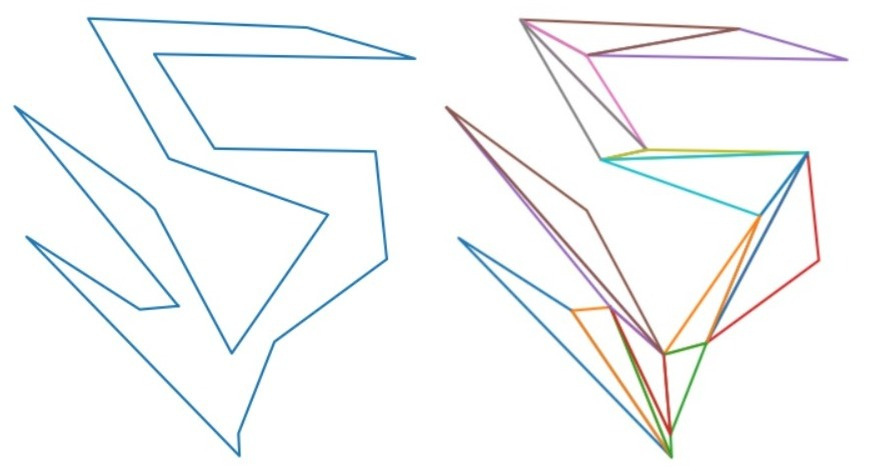
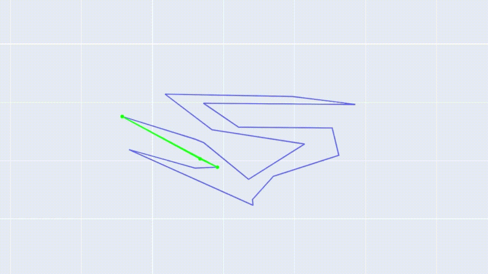
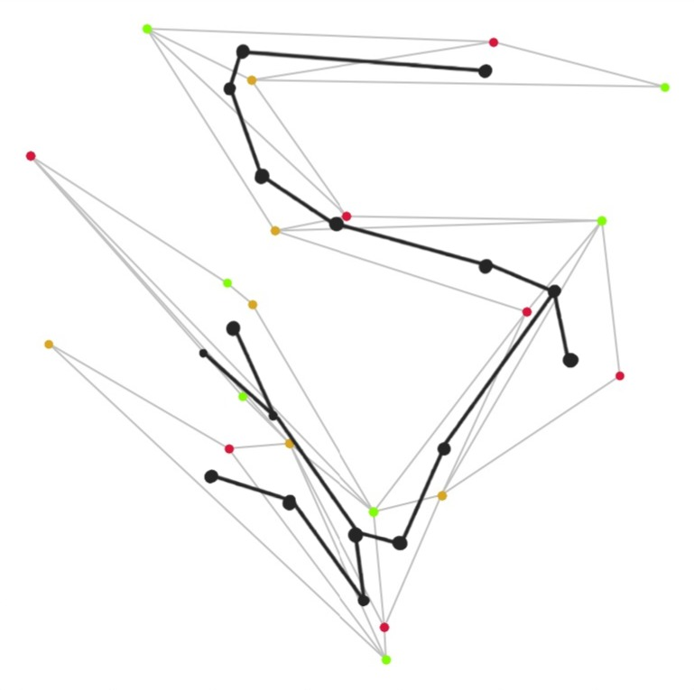
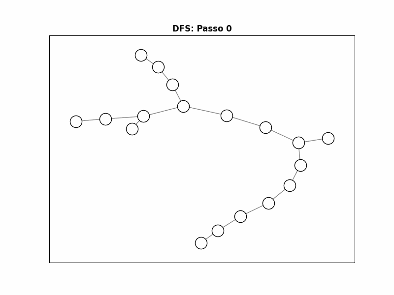
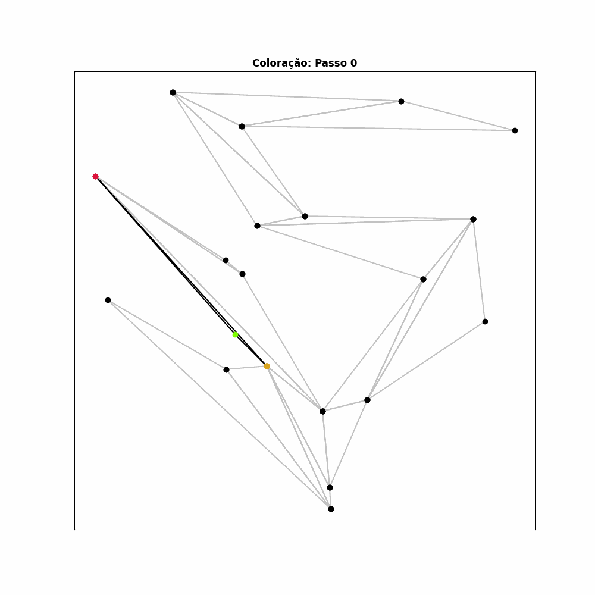

## Relatório - Problema da Galeria de Arte
<b> Integrantes: </b> Antônio Caetano Neves Neto, Beatriz Reis Gama Barbosa, João Lucas Simões Moreira.

# Introdução
O objetivo do trabalho prático 1 foi construir um algoritmo que resolve o problema da galeria de arte para um dado polígono, cujo propósito é decidir o número de câmeras para vigiar uma área e o posicionamento necessário para elas. A solução empregada consistiu em desenvolver dois algoritmos distintos: o <b> algoritmo do corte de orelhas </b>, feito para triangular o polígono de entrada, e o <b> algoritmo da 3-coloração </b>, que foi construído sobre o grafo dual do polígono triangulado, feito para decidir onde posicionar cada câmera necessária, cujo número é ⌊n/3⌋, onde n é o número de triângulos formados.
	
# Metodologia & complexidade
Para esta seção, serão feitos tópicos que descrevem as implementações de cada um dos algoritmos citados na introdução.
<ol> 
	<li>
		Corte de orelhas
	</li>
	O algoritmo do corte de orelhas é uma técnica descrita em sala de aula para realizar a triangulação de um polígono dado, ou seja, transformar um polígono convexo em uma composição de diferentes triângulos. Um exemplo de triangulação pode ser visto na imagem a seguir.   
	
	
Figura 1: à esquerda, polígono de entrada, e à direita, o polígono triangulado.

	Para realizar essa técnica, foi necessário desenvolver algumas funções auxiliares:
	<ul>
		<li>Função <i>is_convex(a, b, c)</i>: necessária para determinar se o polígono formado pelos pontos a, b e c é convexo ou não; </li>
		<li>Função <i>is_in_triangle(a, b, c, p)</i>: necessária para determinar se havia algum ponto p dentro de um triângulo a, b, c formado;</li>
		<li>Função <i>is_clock_wise(polygon)</i>: verifica se os pontos do polígono estão em sentido horário;</li>
	</ul>
	 
	A função principal, chamada <i>get_unique_ear(polygon, n_frames)</i> recebe pontos do polígono de entrada e um valor que representa o número de frames necessários para a animação, e retorna o primeiro triângulo detectado no polígono. Primeiramente, se descobre o tamanho da entrada; caso existam menos de 3 pontos, não é possível realizar a triangulação. Se ela possuir somente 3 pontos, a triangulação é o próprio polígono. Caso possua mais, então é feita uma iteração sobre a entrada, pegando 3 pontos a cada vez. Em seguida, é avaliado se esses 3 pontos formam um polígono convexo, e se sim, é checado se não existem pontos dentro desse polígono. Caso ambas as condições forem válidas, então os três pontos são deletados e o polígono é salvo.  
	O processo de animação corre em um loop que chama sucessivamente a <i>get_unique_ear</i> até que não haja mais opções de triângulos a serem formados. A cada iteração, é exibido o polígono inteiro e o triângulo que está sendo avaliado (em amarelo). Se ele for um triângulo válido, ele é adicionado ao polígono inteiro. A complexidade desse algoritmo é quadrática, pois para cada triângulo formado, é necessário avaliar se existe algum ponto entre os demais que está dentro dele. O vídeo com esse processo pode ser visto abaixo. 
	
	
Figura 2: animação da triangulação.

	 
	<li>
		3-Coloração
	</li>
	O algoritmo da 3-coloração foi utilizado sobre uma instância de grafo que pode ser resolvida em tempo polinomial, apesar de o problema ser conhecidamente NP. Para gerar esse grafo, é necessário transformar o polígono triangulado utilizando as seguintes regras:
	<ul>
		<li>Vértices: cada triângulo do polígono se torna um vértice; </li>
		<li>Arestas: se dois triângulos compartilham uma aresta, então existirá uma aresta entre eles no grafo gerado.</li>
	</ul>
	
	
Figura 3: processo de construção do grafo dual ao polígono de entrada.

	  Com isso, é gerado um grafo dual ao polígono, conexo, que corresponde a uma árvore. Com ele, podemos realizar uma busca em profundidade (DFS), e cada vértice será visitado apenas uma vez. Para cada nó explorado, é feita a coloração de seus 3 vértices associados no polígono triangulado. Como a DFS é proporcional ao número de arestas no grafo dual, a 3-coloração é feita em tempo linear. Os vídeos com os processos descritos (tanto da DFS quanto da coloração) podem ser vistos abaixo.
	
	
Figura 4: animação da DFS.

	
	
Figura 5: animação da coloração.

</ol>

# Conclusão

# Bibliografias
<ul>
	<li>Computational Geometry in C, 2nd ed., J. O’Rourke</li>
	<li>Cormen, T. H., Leiserson, C. E., & Rivest, R. L. (1990). Introduction to algorithms.</li>
	<li>Slides da disciplina de Algoritmos 2</li>
</ul>
